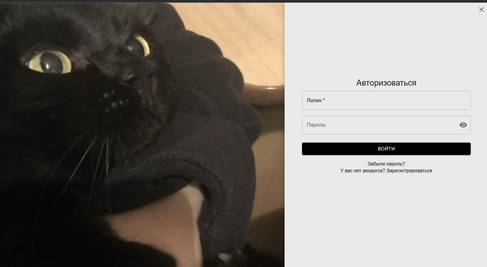
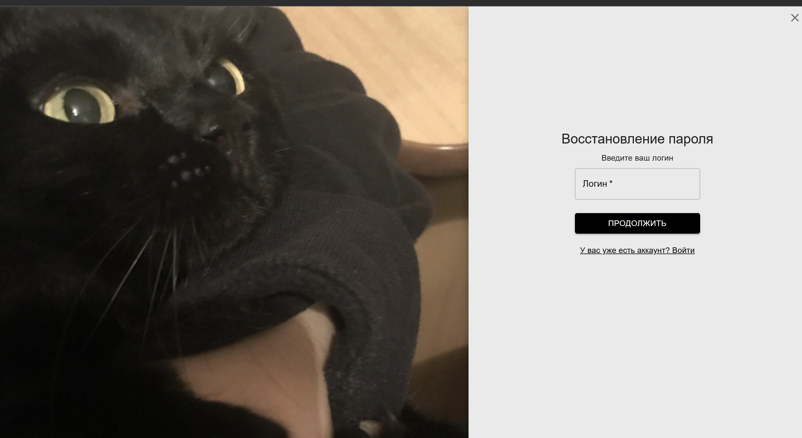
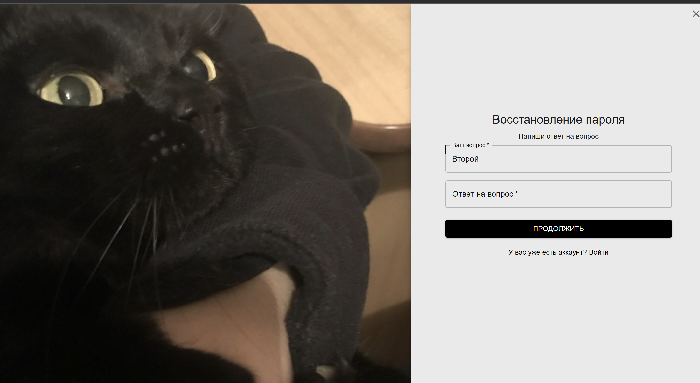

# Форма регистрации и авторизации

Данное приложение представляет собой форму регистрации и авторизации, разработанную на основе **ReactJS** (фронтенд) и **Laravel** (бэкенд). Реализована проверка и валидация полей, а для авторизации используется **JWT-токен**.

---
# Оглавление

1. [Функциональные требования](#функциональные-требования)
2. [Технологический стек](#технологический-стек)
3. [Основные компоненты](#основные-компоненты)
4. [Установка и запуск](#установка-и-запуск)

## Функциональные требования

### Регистрация

- Пользователь может создать учетную запись, указав логин, пароль и другие данные.
- Реализована проверка пароля:
  - Пароль должен содержать:
    - Минимум одну заглавную букву;
    - Минимум одну строчную букву;
    - Минимум одну цифру;
    - Минимальная длина — 8 символов.
- Поля проходят серверную валидацию.

### Авторизация

- Авторизация производится по логину и паролю.
- После успешного входа пользователь получает **JWT-токен**.
- Токен сохраняется в **LocalStorage** и может использоваться для последующих запросов.

### Восстановление пароля

- Пользователь может восстановить доступ к аккаунту, введя логин.
- Для восстановления используется контрольный вопрос и ответ, указанные ранее.

---

## Технологический стек

### Frontend (ReactJS)

- **ReactJS**: для создания пользовательского интерфейса.
- **Material-UI (MUI)**: для стилизации компонентов.
- **Axios**: для выполнения HTTP-запросов.

### Backend (Laravel)

- **Laravel**: серверная логика.
- **JWT-auth**: генерация и проверка токенов.

---

## Основные компоненты

### 1. Форма регистрации

Форма регистрации с проверкой полей, отправляющая данные на бэкенд.

### 2. Форма авторизации

Форма входа, которая отправляет логин и пароль на сервер

### 3. Восстановление пароля

Форма восстановления пароля с проверкой логина и контрольного вопроса.


# Установка и запуск

## Backend (Laravel)

1. **Установите зависимости**:
   ```bash
   composer install
   ```
2. **Настройте .env файл и выполните миграции базы данных:**:
   ```bash
   php artisan migrate
   ```
3. **Установите JWT-библиотеку и сгенерируйте ключ:**:
   ```bash
   composer require tymon/jwt-auth
   php artisan jwt:secret
   ```
4. **Запустите сервер:**:
   ```bash
   php artisan serve
   ```

## Frontend (ReactJS)

1. **Установите зависимости:**:
   ```bash
   npm install
   ```
2. **Настройте API URL в Axios**:
- Откройте файл настройки Axios (например, src/Services/AuthServices.js).
- Убедитесь, что базовый URL указывает на ваш сервер Laravel:
  ```javascript
  const http = axios.create({
  baseURL: "http://localhost:8000/api",
  });
  ```
3. **Запустите React-приложение:**:
   ```bash
   npm start
   ```
